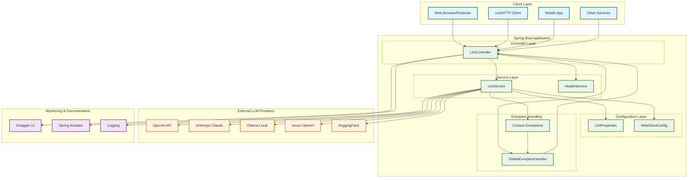
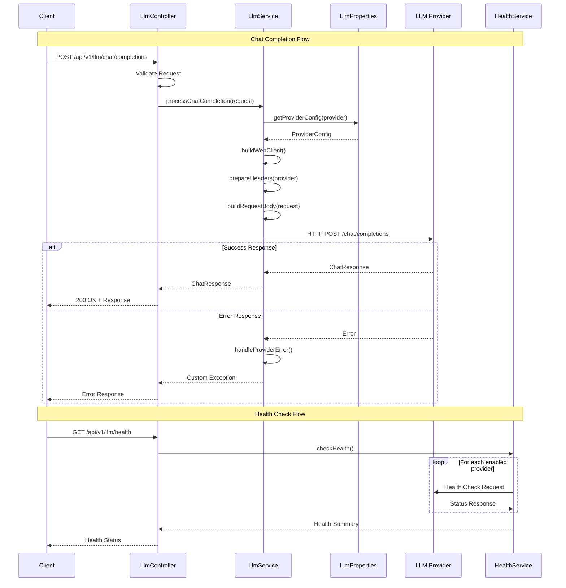
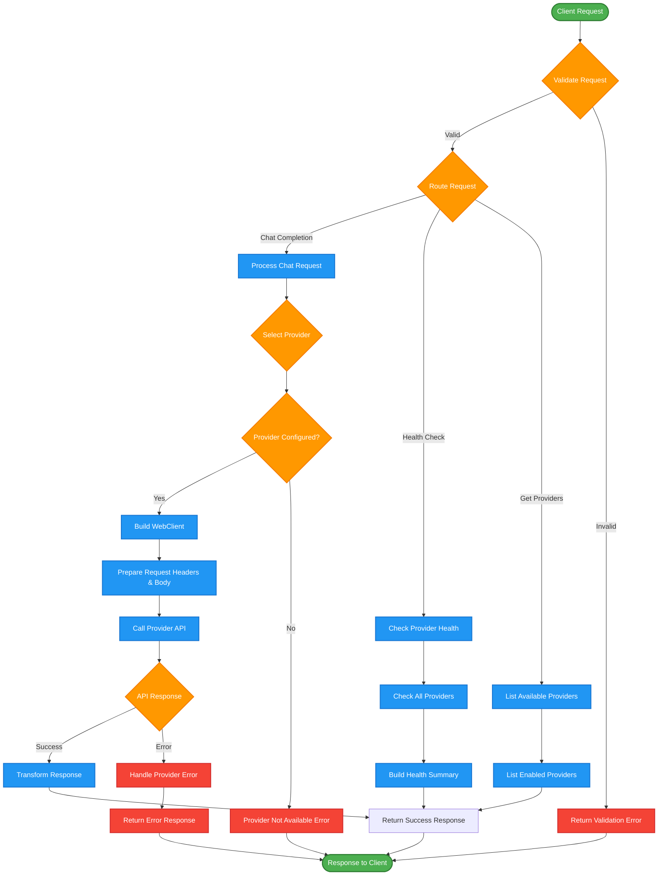
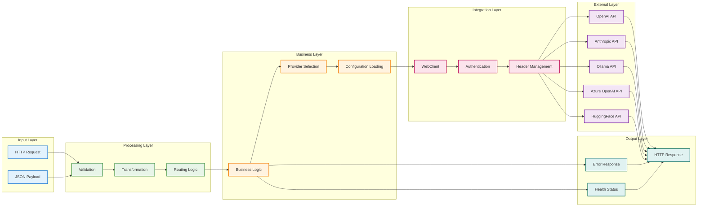
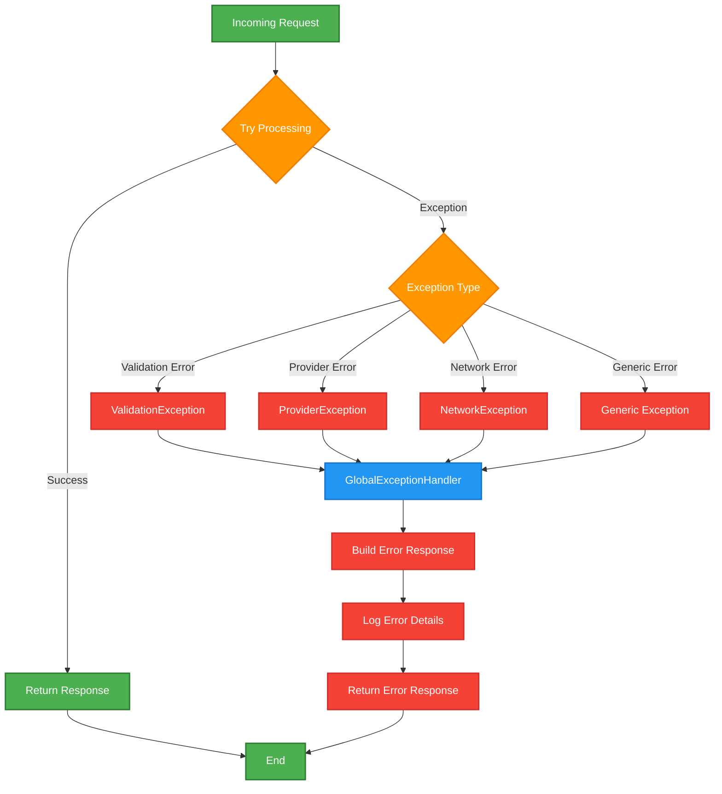

# Architecture Flow Diagram

## High-Level System Architecture



## Request Flow Diagram



## Component Interaction Flow



## Data Flow Architecture



## Error Handling Flow



## Configuration Management Flow

```mermaid
graph TB
    subgraph "Configuration Sources"
        YML[application.yml]
        ENV[Environment Variables]
        PROP[System Properties]
    end

    subgraph "Spring Configuration"
        CP[@ConfigurationProperties]
        VAL[@Validated]
        BIND[Property Binding]
    end

    subgraph "LLM Configuration"
        LP[LlmProperties]
        PC[ProviderConfig]
        DC[Default Config]
    end

    subgraph "Runtime Usage"
        SVC[LlmService]
        WC[WebClient]
        API[API Calls]
    end

    YML --> BIND
    ENV --> BIND
    PROP --> BIND
    
    BIND --> CP
    CP --> VAL
    VAL --> LP
    
    LP --> PC
    LP --> DC
    
    PC --> SVC
    DC --> SVC
    SVC --> WC
    WC --> API

    classDef sourceStyle fill:#e3f2fd,stroke:#1976d2,stroke-width:2px
    classDef springStyle fill:#e8f5e8,stroke:#388e3c,stroke-width:2px
    classDef configStyle fill:#fff3e0,stroke:#f57c00,stroke-width:2px
    classDef runtimeStyle fill:#fce4ec,stroke:#c2185b,stroke-width:2px

    class YML,ENV,PROP sourceStyle
    class CP,VAL,BIND springStyle
    class LP,PC,DC configStyle
    class SVC,WC,API runtimeStyle
```
